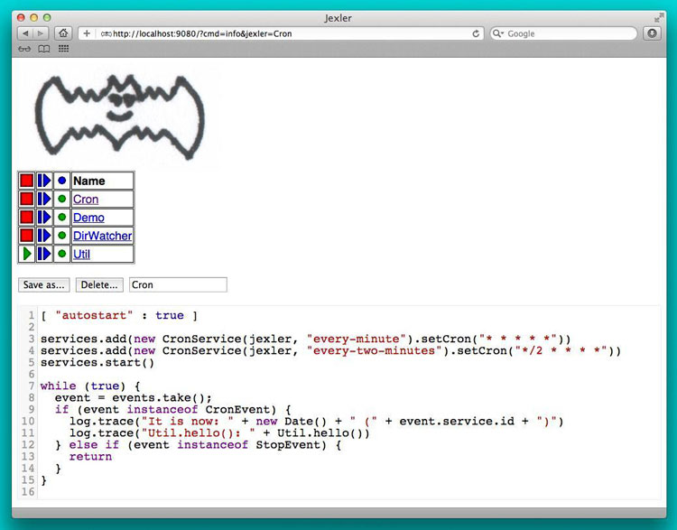
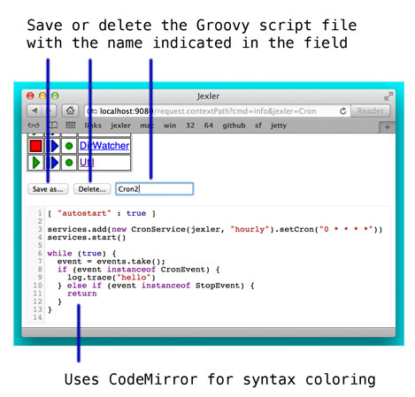

jexler
======

Jexler is a simple relaxed Java 7 framework for starting/stopping
Groovy scripts as services and enabling them to react to events
of their choice.

Introduction
------------

Here's a first example of a jexler Groovy script:

    [ "autostart" : true ]
    
    services.add(new CronService(jexler, "every-minute").setCron("* * * * *"))
    services.start()
    
    while (true) {
      event = events.take();
      if (event instanceof CronEvent) {
        log.info("hello")
      } else if (event instanceof StopEvent) {
        return
      }
    }

The script registers a cron service that will send it a CronEvent every minute and in the event loop below the script waits for events until it receives a StopEvent.

Now instead of just logging the word "hello", let's send an email instead:

    [ "autostart" : true ]
    
    import groovy.grape.Grape
    @Grab('org.apache.commons:commons-email:1.3')
    import org.apache.commons.mail.*
    
    services.add(new CronService(jexler, "every-minute").setCron("* * * * *"))
    services.start()
    
    while (true) {
      event = events.take();
      if (event instanceof CronEvent) {
        new SimpleEmail().with {
          setFrom "jex@jexler.net"
          addTo "bugs@acme.org"
          // ...
          setSubject "hello"
          setMsg "hello from jexler script"
          send()
        }
      } else if (event instanceof StopEvent) {
        return
      }
    }

This uses Groovy *Grape*, which allows to download external libraries and use them immediately in the same script.

And since Groovy is syntactically a superset of Java, you can easily find code samples and libraries for almost anything you might want to do.

Here's how the Web GUI looks like:

What you can see above is essentially a list of jexler Groovy scripts. In the webapp in the file system it looks like this:

    jexler/
      WEB-INF/
        jexlers/
          Cron.groovy
          Demo.groovy
          DirWatcher.groovy
          Util.groovy
          some.properties
          ...
        ...
      ...

The first three jexlers are running, the last one is off, and you could start or stop them in the GUI, or look at the log file, edit the scripts, etc.

If you want to try it out and play with jexler immediately:

* Get the jexler source from github: [https://github.com/jexler/jexler](https://github.com/jexler/jexler)
* Install the Java 7 JDK and Gradle
* `gradle demo`
* Open [http://localhost:9080/](http://localhost:9080/) in a web browser
* See the README at github for alternatives...

Services
--------

###CronService

This service sends a CronEvent at times configurable with a cron string:

    services.add(new CronService(jexler, "hourly").setCron("0 * * * *"))

Note that the `setCron()` method returns its CronService instance, so that setters can be chained.

There are two special cron strings that may be useful for testing:

* "now": Sends a single CronEvent immediately.
* "now+stop": Sends a single CronEvent immediately, followed by a single StopEvent.

The CronEvent class has a single getter `getCron()` to get the cron string that caused the event:

    log.trace(cronEvent.cron)
    
(Note that `cronEvent.cron` is a Groovy shortcut for `cronEvent.getCron()`.)

Implemented using the Open Source [cron4j](http://www.sauronsoftware.it/projects/cron4j/) library.

###DirWatchService

This service observes a directory for changes in the file system and sends events when a file is created, modified or deleted:

    services.add(new DirWatchService(jexler, "watch-jexler-dir"))
    services.start()
    
    while (true) {
      event = events.take();
      if (event instanceof DirWatchEvent) {
        log.trace("Got file change: ${event.kind} '${event.file.name}'")
      } else if (event instanceof StopEvent) {
        return
      }
    }

There are two setters:

* `setDir(File dir)`: The directory to watch,
  default if not set is the directory that contains the jexler.
* `setSleepTimeMs(long sleepTimeMs)`:
   Time to sleep between polling file system,
   default if not set is 1000ms (1 sec).

The DirWatchEvent class has the following getters:

* `File getFile()`: Get file that has been created, modified or deleted.
* `WatchEvent.Kind<?> getKind()`: Get what happened with the file,
   can be StandardWatchEventKinds.ENTRY_CREATE,
   .ENTRY_MODIFY or .ENTRY_DELETE.

Implemented using a Java 7 WatchService.

###More Services

Writing your own services is relatively easy, since you can also write services in Groovy, even from within the jexler web GUI.

The trick is that all Groovy scripts in the jexlers directory are part of the class path.

So, for example, if you wanted a more sophisticated version of CronService, you could copy the CronService.java from the jexler source to a MyCronService.groovy in the jexlers directory in the jexler webapp and do the same for CronEvent. After a few boilerplate changes, you should have a MyCronService that does the same as CronService (this works, I tried it!) and then you could start adding new features, etc.

And if you feel that it would be great if jexler had more services out-of-the-box, feel free to write your own Java or Groovy library of services and make it available.

Side remark: If you wanted an additional service to be included with jexler itself, it would have to be something really, really, really central and generally useful and simple to manage and test, otherwise I wouldn't touch it ;)

And even then...

Tools
-----

###ShellTool

This tool helps to run shell commands:

    shellTool = new ShellTool()
    result = shellTool.run("echo 'hello world'")
    log.trace(result.toString())

There are two setters:

* `setWorkingDirectory(File dir)`:
   Set working directory for the command;
   if not set or set to null, inherit from parent process.
* `setEnvironment(Map<String,String> env)`:
  Set environment variables for the command
  (key is variable name, value is variable value);
  if not set or set to null, inherit from parent process.

Note that the setters again return their ShellTool instance, i.e. setters can be chained:

    result = new ShellTool().setWorkingDirectory('/tmp').run('ls')

And there are two methods for running a shell command:

* `Result run(String command)`
* `Result run(List<String> cmdList)`

The second method allows to explicitly indicate the application to run (first list element) and how to split its arguments.

Passing the right command string can be a bit tricky:

* On windows some common shell commands like "dir" or "echo" are not actually commands, but arguments to cmd.exe, so use e.g. `cmd /c echo hello` as a command string.
* To set the working directory for cygwin, use e.g. `c:/cygwin/bin/bash -l /my/working/dir ls -l`.
* Sometimes there is now way around splitting up arguments explicitly,
  a single string won't do.

The Result contains three items:

* `int rc`: The return code of the command (0 is no error, other values indicate an error).
* `String stdout`: The output of the command.
* `String stderr`: The error output of the command.

If an exception occurs, the return code of the result is set to -1, stderr of the result is set to the stack trace of the exception and stdout of the result is set to an empty string.

Note that the `toString()` method of Result produces a single line string suitable for logging. Line breaks in stdout and stderr are replaced by '%n'.

Implemented using `Runtime.getRuntime().exec()`.

###ObfuscatorTool

This tool can help to obfuscate passwords and other "minor" secret strings. It uses (single) DES, by default with a hard-coded key, see javadoc and code for full details.

* `String obfuscate(String plain)`:
  UTF-8 encode, encipher and hex encode given string.
* `public String deobfuscate(String encHex)`:
  Hex decode, decipher and UTF-8 decode given string.

Simple use case:

* Log obfuscated password:
  `log.trace(new ObfuscatorTool().obfuscate("mysecret"))`
* Copy obfuscated password from log file (and delete entry from log file).
* Use it: `def password = new ObfuscatorTool().deobfuscate("2A8A0F691DB78AD8DA6664D3A25DA963")`

Use your own keys:

* `ObfuscatorTool (String hexKey, String hexIv)`

Note that all of this is not a cryptographically strong protection of secrets, just a countermeasure to fend off the simplest attacks, like e.g. "shoulder surfing". Someone with access to the running jexler with write permission for jexler scripts can easily desobfuscate secrets.

###More Tools

With Java and Groovy plus Grape you have ***thousands*** of tools and libraries at your fingertips, just search the internet when you need something specific.

Note again that since almost all Java code is valid Groovy code, you can search for solutions in Java and Groovy to find something you can use in jexler scripts.

Besides, essentially the same comments as for services apply also to tools. No need to reinvent the wheel.

Web GUI
-------

###Basic Usage

Use the red/green/blue buttons in the first two columns of the table to start/stop/restart a single jexler or all jexlers (top row).

Note that a jexler utility Groovy script that just declares a class with methods simply runs and stops immediately again (since its `main()` method is implicitly empty), so this causes no trouble at all when starting/stopping all jexlers.

The third column allows to view the jexler log file (blue button in top row) and to view any issues that a jexler may have had, where a green button means that there are no issues and a red button can be clicked to view the issue(s).

*Issues* are what jexler usually creates when something exceptionally happens that might require intervention by an administrator to get things running smoothly again.

Jexler uses [logback](http://logback.qos.ch) for logging, by default (see WEB-INF/classes/logback.xml) the jexler webapp logs to `${catalina.base}/logs/jexler.log` (with daily log rotation). If you change that location, the GUI should still automatically find the log file, unless you do something more fancy, like splitting up logging into several files.

Click the name of any jexler in the fourth column to edit its script. Hover over the name to see the run state of the jexler.

There are five run states that apply to a jexler:

* 'off': Not running.
* 'busy (starting)': Busy starting, not ready to process events, yet.
* 'idle': Waiting for an event, i.e. hanging in `event.take()`.
* 'busy (event)': Busy processing an event.
* 'busy (stopping)': Stopping, not processing events any more.

These run states also apply to all jexlers as a group (and technically even to services, like the CronService).

Click the jexler logo to reload the main view. Note that the table with the run states is reloaded automatically every second by JavaScript. You typically only need to reload explicitly if JavaScript is off or for older Internet Explorer browsers for which this feature has not been supported in the jexler web GUI.

Finally, hover over the jexler logo to see the jexler release version.

###Edit jexler Scripts

New files are created simply by typing a new name and clicking save.

Note that save does by default not ask for permission before (over-)writing a script, whereas delete asks by default for permission. These settings can be changed in the web.xml, see further below.

###Issues

Issues are automatically created if a jexler unexpectedly exits by throwing an exception.

Often it is better to catch exceptions within the jexler script to keep the jexler running, and instead to track the exception as a issue in the script:

    try {
      new SimpleEmail().with {
        addTo to
        //...
        send()
      }
      log.trace("mail successfully sent to $to")
    } catch (EmailException e) {
      jexler.trackIssue(jexler, "Could not send mail to $to.", e)
      return false
    }

Parameters are:

* `Service service`: The service where the issue occurred, may be null.
* `String message`: A message that provides information about the issue.
* `Exception exception`: The exception (if any) that caused the issue, may be null.

Tracked issues are always additionally logged with level error (as a single line, with full stack trace, if available, and with linebreaks translated to '%n').

###View Log

Note that newest log entries are on top.

###Customizing (and Security)

Several context parameters can be set in the web.xml.

    <context-param>
      <description>Timeout for starting a jexler in ms.</description>
      <param-name>jexler.start.timeout</param-name>
      <param-value>10000</param-value>
    </context-param>
    <context-param>
      <description>Timeout for stopping a jexler in ms.</description>
      <param-name>jexler.stop.timeout</param-name>
      <param-value>10000</param-value>
    </context-param>

These two parameters control how long the jexler waits before returning to the client when starting / stopping a jexler or all jexlers. (An issue is tracked if the timeout occurs.) Default is 10 sec each.

    <context-param>
      <description>Whether to allow editing jexler scripts in web gui or not.</description>
      <param-name>jexler.security.script.allowEdit</param-name>
      <param-value>true</param-value>
    </context-param>

This parameter can be used to disallow editing of jexler scripts in the GUI as a security measure. Default is to allow editing.

Please be aware that jexler (thanks to Groovy and Grape) is a very powerful tool:

***Giving someone access to a jexler web GUI with write permission for scripts is practically like giving someone shell access as the user under which the web GUI is running***.

So, please protect the web GUI accordingly.

Without write permission, jexler is relatively harmless, also since it is not possible to give a jexler any kind of start parameters in the web GUI without editing the script.

    <context-param>
      <description>Whether to confirm script save in web gui or not.</description>
      <param-name>jexler.safety.script.confirmSave</param-name>
      <param-value>false</param-value>
    </context-param>
    <context-param>
      <description>Whether to confirm script delete in web gui or not.</description>
      <param-name>jexler.safety.script.confirmDelete</param-name>
      <param-value>true</param-value>
    </context-param>

These two parameters indicate whether the web GUI should ask the user to confirm before saving or deleting a jexler script file. Default is false for saving and true for deleting.

Troubleshooting
---------------

###Grape Issue

On one machine (Linux centOS), I had the problem that Grab did initially not work, e.g.:

    @Grab('org.apache.httpcomponents:httpclient:4.2.3')

Apparently, the problem was that Grab tried to acces the local Maven repository (~/.m2/repository) and that there something was missing or only partially there, in any case I got exceptions with text "Error grabbing grapes".

Creating the following ~/.grape/grapeConfig.xml, according to this [stackoverflow thread](http://stackoverflow.com/questions/6335184/groovy-1-8-grab-fails-unless-i-manually-call-grape-resolve), resolved the issue for me:

    <ivysettings>
      <settings defaultResolver="downloadGrapes"/>
      <resolvers>
        <chain name="downloadGrapes">
          <filesystem name="cachedGrapes">
            <ivy pattern="${user.home}/.groovy/grapes/[organisation]/[module]/ivy-[revision].xml"/>
            <artifact pattern="${user.home}/.groovy/grapes/[organisation]/[module]/[type]s/[artifact]-[revision].[ext]"/>
          </filesystem>
          <ibiblio name="ibiblio" m2compatible="true"/>
        </chain>
      </resolvers>
    </ivysettings>

###Mac OS X Tomcat Startup

On Mac OS X in Tomcat I sometimes had the problem that something
within Grape and/or Ivy was apparently not thread safe, so that
autostarting jexlers failed when grabbing dependencies and left
the webapp in a state where also restarting jexlers would not
help any more.

But adding a delay after the startup of each jexler resolved
the issue. To activate this workaround, set a Java System Property
with name `net.jexler.start.wait.ms` and set it to the time in ms
to wait after each jexler start.

I have not been able to reproduce the issue in a unit test,
which suggests it might also be related to Tomcat,
but that is not sure, of course.

Source Code
-----------

The source code is at github: [https://github.com/jexler/jexler](https://github.com/jexler/jexler)

See there for instructions how to build.

The code is a Gradle / Eclipse project that contains two Java sub-projects:

* jexler-core: The core jexler library (JAR) which contains also all services and tools.
* jexler: The jexler web GUI, a simple Java webapp (WAR) with a single JSP.

Java 7 is required.

The jexler-core is deeply tested, close to 100% test coverage in jacoco, except for a few artefacts.

The jexler webapp is very simple and contains a demo unit test that starts it in a Jetty embedded web server.

All interfaces and classes in jexler-core that are not in packages that end with ".internal" are basically public and should normally remain backwards compatible as long as the jexler major version does not change (i.e. jexler 4.5.6 would be backwards compatible with 4.0.0, but 5.0.0 would not; this numbering scheme is common practice). Of course, if only very little people use specific feature or if some new feature reveals itself to be really badly designed, exceptions may be made in order to make life easier for most users.

Within a jexler, the following packages are automatically imported by default:

* net.jexler
* net.jexler.service
* net.jexler.tool

and the following variables are available to jexler Groovy scripts:

* `Jexler jexler`: The jexler instance.
* `Jexlers jexlers`: The jexlers instance, i.e. the class
   that abstracts all jexlers in a directory.
* `List<Event> events`: The list of events to poll for new events.
* `ServiceGroup services`: The group of services to add services to and to start then. It is not mandatory to add any services here, they can also be managed separately, but often it is convenient that services added to this service group are automatically stopped if the jexler exits (regularly or due to an exception).
* `Logger log`: The logback logger for the jexler instance.

###Meta Info

The first line of a jexler script may contain a map with string keys and values of any value, the so called *meta info*, e.g.:

    [ 'autostart' : true, 'autoimport' : true, 'whatever' : 'my words' ]

These are evaluated before running the jexler script, i.e. none of the variables listed above are available for that map. There are two boolean settings that jexler uses by default:

* `autostart`: If true, the jexler is started when the webapp starts up.
   Default is false.
* `autoimport`: If false, the three mentioned packages are not automatically imported. Default is true.

###Distribution

* jexler-core is at [Maven Central](http://search.maven.org/#search%7Cga%7C1%7Cjexler-core)
* jexler webapp and this guide are at [Sourceforge](https://sourceforge.net/projects/jexler/) (see "Files" tab)
* http://www.jexler.net/ hosts [Javadoc](http://www.jexler.net/javadoc/), [jacoco](http://www.jexler.net/jacoco/) and this [guide](http://www.jexler.net/guide/)

Use Cases
---------

###httest Binaries

I use jexler so far (July 2013) mainly for nightly jexler builds and:

*For building binaries for the httest HTTP Test Tool on four different platforms (Mac, Windows, Linux Debian 32 bit and 64 bit).*

Httest is an Open Source (mainly C) command line tool written by Christian Liesch:

"httest is a script based tool for testing and benchmarking web applications, web servers, proxy servers and web browsers. httest can emulate clients and servers in the same test script, very useful for testing proxys."

* Project: [http://htt.sourceforge.net/](http://htt.sourceforge.net/)
* Sourceforge: [http://sourceforge.net/projects/htt/](http://sourceforge.net/projects/htt/)
* Binaries: [http://www.jexler.net/htt/](http://www.jexler.net/htt/)

I made some minor contributions to the project and I build httest binaries automatically using jexler whenever a new httest source code relelase appears at Sourceforge (plus nightly builds). An automatic build consists roughly of the following steps:

* Check out source from git repository at Sourceforge.
* Build and make some basic tests, using also the ShellTool.
* If OK, upload binaries to http://www.jexler.net/htt/ and update index.html there.
* If OK, check in binaries into a separate git repository (for historizing binaries).
* Send mail to notify some people about success or failure.

On each of the four platforms, there is an independent Tomcat with its jexler webapp.

###Checks and Cleanups

At work I have used it a little for small maintenance things, e.g. for checking if certain Hudson nightly builds have really run, for cleaning up log files and for warning if disk space is getting low.

###More

I am curious whether and for what purposes jexler might be used, but would also not be angry if practically nobody uses it, it was fun to write jexler and I personally like it, both from a technical and an artistic perspective - that's reward enough for me :)

Jexler is maybe more suited for tasks that have some leisure in them, but in principle you could also imagine to write a web server with jexlers as handlers or similar things.

Keep me updated at [jex@jexler.net](mailto:jex@jexler.net). (Please be patient, I might not read mails to that address regularly.)

Roadmap
-------

Well, there is none, except to keep jexler really small and to keep the quality high. :)

I will gladly link third party libraries and similar additions around jexler on my web site and, if you want to take it all to a new level, feel free to do so within jexler's Apache 2 Open Source license.

Or to put it a bit more poetically, to me jexler is an island,
things may flow freely around it, but jexler itself is unlikely
to change much.

Copyright &copy; 2012-now $(whois jexler.net)  
[http://www.jexler.net/](http://www.jexler.net/)

Note also that the jexler logo with the bat is my own creation (*2010).

License
-------

Licensed under the Apache License, Version 2.0 (the "License");  
you may not use this file except in compliance with the License.  
You may obtain a copy of the License at

[http://www.apache.org/licenses/LICENSE-2.0](http://www.apache.org/licenses/LICENSE-2.0)

Unless required by applicable law or agreed to in writing, software  
distributed under the License is distributed on an "AS IS" BASIS,  
WITHOUT WARRANTIES OR CONDITIONS OF ANY KIND, either express or implied.  
See the License for the specific language governing permissions and  
limitations under the License.