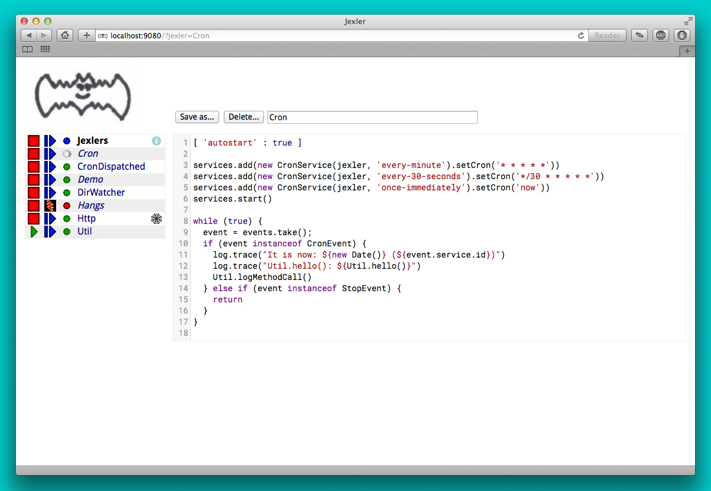
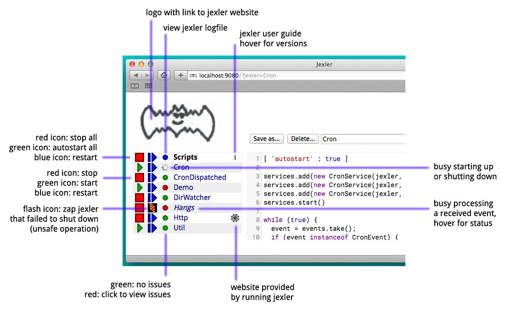
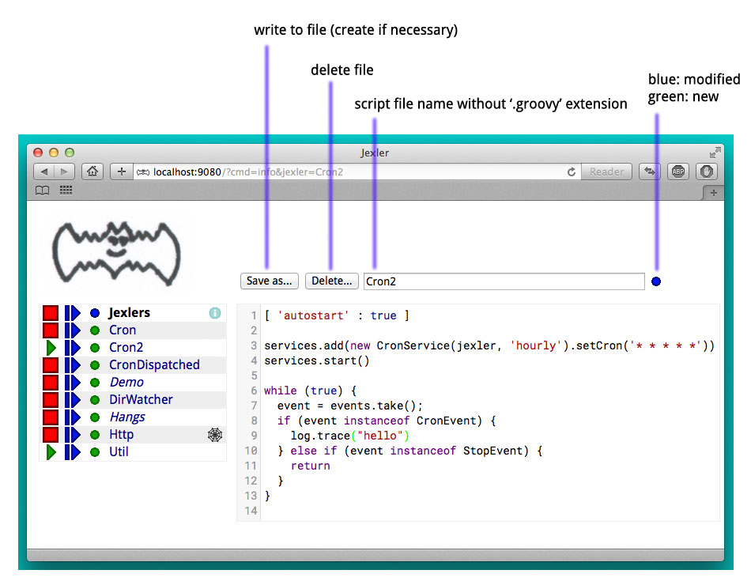
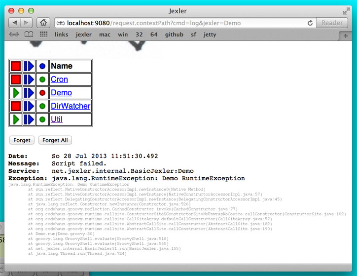

image:https://www.jexler.net/jexler.jpg["Jexler", link="https://www.jexler.net/"]

== jexler

Jexler is a simple relaxed Groovy framework for starting/stopping
Groovy scripts as services and enabling them to react to events
of their choice - great for prototyping and useful for automating.

== Introduction

Here's a first example of a jexler Groovy script:
[source,groovy]
----
[ 'autostart' : true ]

services.add(new CronService(jexler, 'every-minute').setCron('* * * * *'))
services.start()

while (true) {
  event = events.take();
  if (event instanceof CronEvent) {
    log.info('hello')
  } else if (event instanceof StopEvent) {
    return
  }
}
----

The script registers a cron service that will send it a CronEvent
every minute and in the event loop below the script waits for events
until it receives a StopEvent.

Now instead of just logging the word "hello", let's send an email instead:

[source,groovy]
----
[ 'autostart' : true ]

@Grab('org.apache.commons:commons-email:1.3')
import org.apache.commons.mail.*

services.add(new CronService(jexler, 'every-15-seconds').setCron('*/15 * * * * *'))
services.start()

while (true) {
  event = events.take();
  if (event instanceof CronEvent) {
    new SimpleEmail().with {
      setFrom 'jex@jexler.net'
      addTo 'bugs@acme.org'
      // ...
      setSubject 'hello'
      setMsg 'hello from jexler script'
      send()
    }
  } else if (event instanceof StopEvent) {
    return
  }
}
----

This uses Groovy *Grape*, which allows to download external libraries
and use them immediately in the same script.

And since Groovy is syntactically a superset of Java, you can easily find
code samples and libraries for almost anything you might want to do.

Here's how the Web GUI looks like:

What you can see above is essentially a list of jexler Groovy scripts.
In the webapp in the file system it looks like this:

----
jexler/
  WEB-INF/
    jexlers/
      Cron.groovy
      Demo.groovy
      DirWatcher.groovy
      Util.groovy
      some.properties
      ...
    ...
  ...
----

The first two jexlers are running, the third one is off, and you could start
or stop them in the GUI, or look at the log file, edit the scripts, etc.

If you want to try it out and play with jexler immediately:

* Get the jexler source from github: https://github.com/jexler/jexler
* Install the Java 8 JDK (or later) and Gradle
* `gradle demo`
* Open http://localhost:9080/ in a web browser
* See the README at github for alternatives...

=== Dispatching

It is also possible to define a jexler in a more structured way by defining
methods that handle different life cycle stages and received events:

[source,groovy]
----
[ 'autostart' : true ]

// dispatch to methods below
JexlerDispatcher.dispatch(this)

// optional, called first
void declare() {
  log.trace('-- declare()')
  cron = '* * * * *'
}

// mandatory, called after declare(), before the event loop
void start() {
  log.trace("-- start()")
  services.add(new CronService(jexler, 'EveryMinute').setCron(cron))
  services.add(new CronService(jexler, 'Every30Seconds').setCron('0/30 * * * * *'))
  services.add(new CronService(jexler, 'OnceImmediately').setCron('now'))
  services.start()
}

// optional*, called during event loop
// handle<event-class><service-id>(event), searched first
void handleCronEventEveryMinute(def event) {
  log.trace('-- handleCronEventEveryMinute(event)')
  log.trace("every minute, it is now ${new Date()} ($event.service.id)")
}

// optional*, called during event loop
// handle<event-class><service-id>(event), searched second
void handleCronEventEvery30Seconds(def event) {
  log.trace('-- handleCronEventEvery30Seconds(event)')
  log.trace('every 30 seconds')
}

// optional*, called during event loop
// handle(event), fallback, searched last
// * if no matching handler was found, an issue is tracked
void handle(def event) {
 log.trace('-- handle(event)')
  log.trace("got event $event.service.id")
}

// optional, called after receiving StopEvent in the event loop, just before the script returns
void stop() {
  log.trace('-- stop()')
  // nothing to do, services.stop() is called automatically after the script returns
}
----

So that the first example above could e.g. be written as:

[source,groovy]
----
[ 'autostart' : true ]

JexlerDispatcher.dispatch(this)

void start() {
  services.add(new CronService(jexler, 'every-minute').setCron('* * * * *'))
  services.start()
}

void handleCronEvent(def event) {
    log.info('hello')
}
----

Under the hood, it is still just a running Groovy script (and if you do not
like the default behavior of `JexlerDispatcher`, get its Groovy source from the jexler
source at github and copy it to a  Groovy script called e.g. `MyJexlerDispatcher.groovy`
put it into the jexlers directory, adjust it as needed, and then call
`MyJexlerDispatcher.dispatch(this)` instead at the top of your jexler scripts).

=== Handling HTTP Requests

HTTP requests sent to the jexler webapp with request parameters `cmd=http&jexler=<jexler-id>`
are passed to a method `handleHttp(PageContext p)`
of the corresponding jexler, if found and the jexler is operational.
The method parameter is a `javax.servlet.jsp.PageContext`, i.e. you can use
things like `p.request`, `p.request.parameters.myparam`, `p.out`, `p.session`,
`p.servletContext`, etc. in the handler.

Simple example:

[source,groovy]
----
void handleHttp(def p) {
  p.response.status = 200
  p.out.println("""\
<html>
  <head>
    <title>Jexler Http</title>
  </head>
  <body>
    <h1>Jexler Http</h1>
    
    
Status: $p.response.status

    </pre>
  </body>
</html>
""")
}
----

If an exception occurs in the handler, a simple 500 error page is returned.
Similarly, if there is no corresponding operational jexler or it contains
no handler with the above signature, a 404 error page is returned.

In the GUI, a web icon is shown on the right when the jexler is available
for HTTP requests and clicking the icon takes you there.

Note that incoming HTTP requests are processed in parallel to the normal jexler
event queue, possibly in several threads created by the web container.
Make sure operations are thread-safe in these two respects.

== Services

=== CronService

This service sends a CronEvent at times configurable with a cron string:

[source,groovy]
services.add(new CronService(jexler, "hourly").setCron("0 * * * *"))

Note that the `setCron()` method returns its CronService instance, so that setters can be chained.

There are two special cron strings that may be useful for testing:

* "now": Sends a single CronEvent immediately.
* "now+stop": Sends a single CronEvent immediately, followed by a single StopEvent.

The CronEvent class has a single getter `getCron()` to get the cron string that caused the event:

[source,groovy]
log.trace(cronEvent.cron)
    
(Note that `cronEvent.cron` is a Groovy shortcut for `cronEvent.getCron()`.)

Implemented using the Open Source https://www.quartz-scheduler.org[Quartz] library.

By default, a Quartz `Scheduler` instance that is shared between all jexlers
is used (because each scheduler creates a new thread). Alternatively, the scheduler
can be explicitly set when constructing the `CronService` instance:
`setScheduler(Scheduler scheduler)`.

==== Quartz Cron Strings

Quartz allows to trigger with a resolution of seconds (and optionally allows
also to define years). This means that Quartz cron strings contain 6 (or 7)
fields, instead of the usual 5.

Naively, you would configure a cron for every second as "* * * * * *", but
for some strange reason (which escapes me), Quartz mandates that one of
day-of month (position 4) or day-of-week (position 6) must be '?' (but not both).

Don't worry, Jexler handles this for you, normal short cron strings like
"* * * * *" are expanded to a valid quartz cron string like "0 * * * * ?"
and also for long cron strings like "0 * * * * 1-5" a '?' is automatically
replaced where needed, like to "0 * * ? * 1-5".

=== DirWatchService

This service observes a directory for changes in the file system and sends events
when a file is created, modified or deleted:

[source,groovy]
----
services.add(new DirWatchService(jexler, 'watch-jexler-dir'))
services.start()

while (true) {
  event = events.take();
  if (event instanceof DirWatchEvent) {
    log.trace("Got file change: ${event.kind} '${event.file.name}'")
  } else if (event instanceof StopEvent) {
    return
  }
}
----

There are the following setters:

* `setDir(File dir)`: The directory to watch,
   default if not set is the directory that contains the jexler.
* `setKinds(List<WatchEvent.Kind> kinds)`: Kinds of events to watch for.
   Default if not set is standard events for create, modify and delete
* `setModifiers(List<WatchEvent.Modifier> modifiers)`:
   Modifiers for watching, default if not set is empty.
   Useful particularly on Mac OS X, where there is no native support
   in the JVM and instead the file system is polled, apparently every
   10 seconds by default. To reduce this to 2 seconds, pass a modifier
   `com.sun.nio.file.SensitivityWatchEventModifier.HIGH`.
* `setCron(String cron)`: When to poll the WatchService.
   Default if not set is every 5 seconds ("*/5 * * * * ?").
   Note that it may take even longer than that for the underlying
   Java WatchService to register the change.
* `setScheduler(Scheduler scheduler)`: Sets the Quartz scheduler,
   default if not set is a shared scheduler.

The DirWatchEvent class has the following getters:

* `File getFile()`: Get file that has been created, modified or deleted.
* `WatchEvent.Kind<?> getKind()`: Get what happened with the file,
   can be StandardWatchEventKinds.ENTRY_CREATE,
   .ENTRY_MODIFY or .ENTRY_DELETE.

Implemented using a Java 7 WatchService (and Quartz).

=== More Services

Writing your own services is relatively easy, since you can also write services
in Groovy, even from within the jexler web GUI.

The trick is that all Groovy scripts in the jexlers directory are part of the class path.

So, for example, if you wanted a more sophisticated version of CronService, you could
copy the CronService.groovy from the jexler source to a MyCronService.groovy in the
jexlers directory in the jexler webapp and do the same for CronEvent.
After a few boilerplate changes you could start adding new features, etc.

And if you feel that it would be great if jexler had more services out-of-the-box,
feel free to write your own library of services and make it available.

Side remark: If you wanted an additional service to be included with jexler itself,
it would have to be something really, really, really central and generally useful and simple
to manage and test, otherwise I wouldn't touch it ;)

And even then...

== Tools

=== ShellTool

This tool helps to run shell commands. (Note that there are already at least
two standard ways of doing this with Groovy APIs, which may or may not be
more convenient depending on your use case.)

[source,groovy]
shellTool = new ShellTool()
result = shellTool.run("echo 'hello world'")
log.trace(result.toString())

There are the following setters:

* `setWorkingDirectory(File dir)`:
  Set working directory for the command;
  if not set or set to null, inherit from parent process.
* `setEnvironment(Map<String,String> env)`:
  Set environment variables for the command
  (key is variable name, value is variable value);
  if not set or set to null, inherit from parent process.
* `setStdoutLineHandler(Closure<?> handler)`:
  Set a closure that will be called to handle each line of stdout;
  if not set or set to null, do nothing.
* `setStderrLineHandler(Closure<?> handler)`:
  Set a closure that will be called to handle each line of stderr;
  if not set or set to null, do nothing.

Note that the setters again return their ShellTool instance,i.e. setters can be chained:

[source,groovy]
result = new ShellTool().setWorkingDirectory('/tmp').setStderrLineHandler({log.info(it)}).run('ls')

And there are two methods for running a shell command:

* `Result run(String command)`
* `Result run(List<String> cmdList)`

The second method allows to explicitly indicate the application to run
(first list element) and how to split its arguments.

Passing the right command string can be a bit tricky:

* On windows some common shell commands like "dir" or "echo" are not actually commands,
  but arguments to cmd.exe, so use e.g. `cmd /c echo hello` as a command string.
* To set the working directory for cygwin, use e.g. `c:/cygwin/bin/bash -l /my/working/dir ls -l`.
* Sometimes there is no way around splitting up arguments explicitly, a single string won't do.

The Result contains three items:

* `int rc`: The return code of the command (0 is no error, other values indicate an error).
* `String stdout`: The output of the command.
* `String stderr`: The error output of the command.

If an exception occurs, the return code of the result is set to -1,
stderr of the result is set to the stack trace of the exception and stdout
of the result is set to an empty string.

Note that the `toString()` method of Result produces a single line string suitable
for logging. Line breaks in stdout and stderr are replaced by '%n'.

Implemented using `Runtime.getRuntime().exec()`.

=== StringObfuscatorTool

This tool can help to obfuscate passwords and other sensitive strings.
By default, it uses 128 bit AES with a hard-coded key, see below plus code/groovydoc for full details.

* `String obfuscate(String plain)`:
  UTF-8 encode, pad with random bytes, encipher and hex encode given string.
* `public String deobfuscate(String encHex)`:
  Hex decode, decipher, unpad and UTF-8 decode given string.
* `StringObfuscatorTool()`: Default constructor.
   Chooses 128 bit AES (AES/CBC/PKCS5Padding) with a hard-coded default key and iv,
   and sets byteBufferPadLen to 64, which limits plain strings to max 47 characters
   (resp. less if some plain string characters need more than one byte UTF-8 encoded).
* `StringObfuscatorTool setParameters(String hexKey, String hexIv, String algorithm, String transformation)`:
  Set key, iv, algorithm and transformation.
* `StringObfuscatorTool setByteBufferPadLen(int len)`:
  Set the length to which to pad the plain string as UTF-8 encoded byte buffer.

Simple use case:

* Log obfuscated password:
  `log.trace(new StringObfuscatorTool().obfuscate("mysecret"))`
* Copy obfuscated password from log file (and delete entry from log file).
* Use it: `def password = new StringObfuscatorTool().deobfuscate("2A8A0F ... 5DA963")`

Note that this is overall not a cryptographically strong protection of secrets,
just a countermeasure to fend off the simplest attacks, like e.g. "shoulder surfing".
Someone with access to the running jexler with write permission for jexler scripts
can easily deobfuscate secrets. Someone with only read access to jexler scripts
can also simply copy the obfuscated string and deobfuscate it on a different
jexler instance. To fend off that attack, e.g. store obfuscated passwords in files
in the jexlers directory:

[source,groovy]
new File("password.txt").setText(new StringObfuscatorTool().obfuscate("mysecret"))
def password = new StringObfuscatorTool().deobfuscate(new File("password.txt").text)

To obfuscate things even a little more, you could set custom cipher parameters
that you would read from a file, or maybe even consider something like the following.
Subclass the StringObfuscatorTool class in Groovy (or Java):

[source,groovy]
class MyObfuscatorTool extends net.jexler.tool.StringObfuscatorTool {
  public MyObfuscatorTool() {
    setParameters("00--my-AES-128-secret-key-hex-00", "00--my-AES-128-secret-iv-hex--00",
      "AES", "AES/CBC/PKCS5Padding")
  }
}

Compile the class and place the resulting class file in the jexlers directory
or within the WEB-INF/lib directory, i.e. add it to the classpath of the running jexlers.
This would make it a little harder to deobfuscate strings even to someone with
read access to the files in the jexlers resp. WEB-INF/lib directory, because the keys
are somewhat "hidden" in the class file.

=== More Tools

With Java and Groovy plus Grape you have ***thousands*** of tools and libraries
at your fingertips, just search the internet when you need something specific.

Note again that since almost all Java code is valid Groovy code, you can search
for solutions in Java and Groovy to find something you can use in jexler scripts.

Besides, essentially the same comments as for services apply also to tools.
No need to reinvent the wheel.

== Web GUI

=== Basic Usage

Use the red/green/blue buttons in the first two columns of the table to start/stop/restart
a single jexler or all jexlers (top row).

Note that a jexler utility Groovy script that just declares a class with methods
simply runs and stops immediately again (since its `main()` method is implicitly empty),
so this causes no trouble at all when starting/stopping all jexlers.

The third column allows to view the jexler log file (blue button in top row) and
to view any issues that a jexler may have had, where a green button means that
there are no issues and a red button can be clicked to view the issue(s).

*Issues* are what jexler usually creates when something exceptionally happens that might
require intervention by an administrator to get things running smoothly again.

Jexler uses https://logback.qos.ch[logback] for logging, by default
(see WEB-INF/classes/logback.xml) the jexler webapp logs to `${catalina.base}/logs/jexler.log`
(with daily log rotation). If you change that location, the GUI should still automatically
find the log file, unless you do something more fancy, like splitting up logging into several files.

Click the name of any jexler in the fourth column to edit its script.
Hover over the name to see the service state of the jexler.

There are five service states that apply to a jexler:

* *off*: Not running.
* *busy (starting)*: Busy starting, not ready to process events, yet.
* *idle*: Waiting for an event, i.e. hanging in `event.take()`.
* *busy (event)*: Busy processing an event.
* *busy (stopping)*: Stopping, not processing events any more.

These states also apply to all jexlers as a group (and technically to all
classes that implement the `Service` interface, like the CronService).

Click the jexler logo to reload the main view. Note that the table with the service
states is reloaded automatically every second by JavaScript. You typically only need
to reload explicitly if JavaScript is off or for very old Internet Explorer browsers
for which this feature has not been supported in the jexler web GUI.

Hover over the jexler logo to see the jexler release version.

If a jexler becomes unresponsive, i.e. does not respond to stopping within the timeout,
the stop icon changes to a flash icon in the GUI. This allows to "zap" the jexler, which
means to stop the jexler thread with `Thread#stop()` and to stop all of its services.
Note that if the jexler script started more threads those won't be stopped and stopping
a thread can also have other side effects, in fact it is generally considered unsafe.

If you need jexlers to react to stop events between polling events, it is better
to do this programmatically, using `events.nextIsStop()` (equivalent to
`events.peek() instanceof StopEvent`) to tell if the next event is a stop event
and `events.hasStop()` to tell if there are any stop events in the event queue.
Zapping should usually only be used as a last resort before restarting the
containing Java VM.

=== Edit jexler Scripts

New files are created simply by typing a new name and clicking save.

Note that save does by default not ask for permission before (over-)writing a script,
whereas delete asks by default for permission. These settings can be changed in the web.xml,
see further below.

=== Issues

Issues are automatically created if a jexler unexpectedly exits by throwing an exception.

Often it is better to catch exceptions within the jexler script to keep the jexler running,
and instead to track the exception as a issue in the script:

[source,groovy]
try {
  new SimpleEmail().with {
    addTo to
    //...
    send()
  }
  log.trace("mail successfully sent to $to")
} catch (EmailException e) {
  jexler.trackIssue(jexler, "Could not send mail to $to.", e)
  return false
}

Parameters are:

* `Service service`: The service where the issue occurred, may be null.
* `String message`: A message that provides information about the issue.
* `Exception exception`: The exception (if any) that caused the issue, may be null.

Tracked issues are always additionally logged with level error (as a single line,
with full stack trace, if available, and with linebreaks translated to '%n').

=== View Log

image:jexler-gui-log.jpg[web gui view log file]

Note that newest log entries are on top.

=== Customizing (and Security)

Several context parameters can be set in the web.xml.

[source,xml]
<context-param>
  <description>Timeout for starting a jexler in ms.</description>
  <param-name>jexler.start.timeout</param-name>
  <param-value>10000</param-value>
</context-param>
<context-param>
  <description>Timeout for stopping a jexler in ms.</description>
  <param-name>jexler.stop.timeout</param-name>
  <param-value>10000</param-value>
</context-param>

These two parameters control how long the jexler waits before returning
to the client when starting / stopping a jexler or all jexlers.
(An issue is tracked if the timeout occurs.) Default is 10 sec each.

[source,xml]
<context-param>
  <description>Whether to allow editing jexler scripts in web gui or not.</description>
  <param-name>jexler.security.script.allowEdit</param-name>
  <param-value>true</param-value>
</context-param>

This parameter can be used to disallow editing of jexler scripts in the GUI as a security measure. Default is to allow editing.

Please be aware that jexler (thanks to Groovy and Grape) is a very powerful tool:

*_Giving someone access to a jexler web GUI with write permission for scripts
is practically like giving someone shell access as the user under which
the web GUI is running_*.

So, please protect the web GUI accordingly.

Without write permission, jexler is relatively harmless, also since it is not possible
to give a jexler any kind of start parameters in the web GUI without editing the script.

[source,xml]
<context-param>
  <description>Whether to confirm script save in web gui or not.</description>
  <param-name>jexler.safety.script.confirmSave</param-name>
  <param-value>false</param-value>
</context-param>
<context-param>
  <description>Whether to confirm script delete in web gui or not.</description>
  <param-name>jexler.safety.script.confirmDelete</param-name>
  <param-value>true</param-value>
</context-param>

These two parameters indicate whether the web GUI should ask the user to confirm
before saving or deleting a jexler script file. Default is false for saving and true for deleting.

== Troubleshooting

=== Grape Concurrency Issues

There is a bug in Groovy/Grape and Ivy up to at least Groovy 2.4.3 / Ivy 2.4.0.
Using Grape is simply not thread-safe (unless only a single GroovyClassLoader
is used), see https://issues.apache.org/jira/browse/GROOVY-7407

This shows especially at startup when autostarting jexlers or later if starting
all jexlers with autostart set.

As a workaround, you can set the following system property:

* `net.jexler.workaround.groovy.7407.grape.engine.wrap`:
  If set to "true", the GrapeEngine in the Grape class will be wrapped,
  so that all Grape calls (@grab etc.) will be synchronized on Grape.class.
  See the above link for more details and limitations.

== Source Code

The source code is at github: https://github.com/jexler/jexler

See there for instructions how to build.

The code is a Gradle project that contains two Java sub-projects:

* *jexler-core*: The core jexler library (JAR) which contains also all services and tools.
* *jexler*: The jexler web GUI, a simple webapp (WAR) with a single JSP.

jexler-core is deeply tested, close to 100% test coverage in jacoco,
except for a few artifacts and except that jacoco underrates Groovy
coverage for purely technical reasons.
Unit tests are written with https://code.google.com/p/spock/[Spock],
the fascinating Groovy test framework.

The jexler webapp is very simple and contains a demo unit test that starts it in a Jetty embedded web server.

Within a jexler, the following packages are automatically imported by default:

* `net.jexler`
* `net.jexler.service`
* `net.jexler.tool`

and the following variables are available to jexler Groovy scripts (binding):

* `Jexler jexler`: The jexler instance.
* `JexlerContainer container`: The jexler container instance, i.e. the class
   that abstracts all jexlers in a directory.
* `List<Event> events`: The list of events to poll for new events.
* `ServiceGroup services`: The group of services to add services to and to start then.
   It is not mandatory to add any services here, they can also be managed separately,
   but often it is convenient that services added to this service group are automatically
   stopped if the jexler exits (regularly or due to an exception).
* `Logger log`: The logback logger for the jexler instance.

It is even possible to access the binding variables from other classes,
use e.g. `jexlerBinding.log` to access the logger:

[source,groovy]
----
class Util {
  static def log = jexlerBinding.log
  static {
    log.trace("Class loaded for jexler '${jexlerBinding.jexler.id}'")
  }
  static logMethodCall() {
    log.trace("Method called for jexler '${jexlerBinding.jexler.id}'")
  }
}
----

This is implemented by always adding the following class to the Groovy
classpath plus, by default, by statically importing its `jexlerBinding`
member variable with every compiled source.

[source,groovy]
----
package net.jexler
@groovy.transform.CompileStatic
class JexlerBinding {
  public static Map<String,Object> jexlerBinding
}
----

=== Meta Info

The first line of a jexler script may contain a map with string keys and values
of any value, the so called *meta info*, e.g.:

[source,groovy]
----
[ 'autostart' : true, 'autoimport' : true, 'whatever' : 'my words' ]
----

These are evaluated before running the jexler script, i.e. none of the variables
listed above are available for that map.
There are two boolean settings that jexler uses by default:

* `autostart`: If true, the jexler is started when the webapp starts up.
   Default is false.
* `autoimport`: If false, the three mentioned packages are not automatically
   imported and there is no static import of `JexlerBinding.jexlerBinding`.
   Default is true.

=== Distribution

* The jexler-core JAR is at https://search.maven.org/#search%7Cga%7C1%7Cjexler-core[Maven Central]
* The jexler webapp is at https://sourceforge.net/projects/jexler/[Sourceforge] (see "Files" tab)
* The website https://www.jexler.net/[www.jexler.net] hosts https://www.jexler.net/groovydoc/[Groovydoc],
  https://www.jexler.net/jacoco/[JaCoCo] and this https://www.jexler.net/guide/[guide]

== Use Cases

=== Automatic Builds (jexler itself and httest Binaries)

In 2013, I have used jexler to make nightly builds of jexler on four different
platforms: Mac, Windows and Debian Linux 32 bit and 64 bit. This included roughly
checking out the source from git, running the build and sending a mail with
the result if not OK. On each of the four platforms, there was an independent
Tomcat with its jexler webapp (and jexlers shared via a "private" git repository
at sourceforge).

On the same four platforms, I also made nightly and release builds of **httest**,
an Open Source HTTP test tool written in C by Christian Liesch
(and with some minor contributions by me and others):

* "httest is a script based tool for testing and benchmarking web applications,
web servers, proxy servers and web browsers. httest can emulate clients and servers
in the same test script, very useful for testing proxys."
* Project: https://htt.sourceforge.net/
* Sourceforge: https://sourceforge.net/projects/htt/
* Binaries (by me): https://www.jexler.net/htt/

Release builds were triggered automatically by polling sourceforge for a new httest
source release. After checking out the source and building the binaries, the binaries
were uploaded via FTP to www.jexler.net and notification mails sent, as needed.
The builds (nightly and release) included also to run all tests automatically and
provide a test report. The Windows build resulted also in a Visual Studio Solution,
complete with all needed external libraries and includes. For building on Windows,
a combination of cygwin and Visual Studio was used, so that most parts of the build
could be shared as bash scripts across all four platforms, but that's already
a different story...

=== Checks and Cleanups

At work I continue to use it since 2013 for various minor maintenance things,
e.g. for checking if certain nightly builds have really run or for warning
when disk space is getting low resp. cleaning up right away in that case,
and for a few more things, including a few simple web GUIs.

=== More

I am curious whether and for what purposes jexler might be used, but would also not be angry
if practically nobody uses it, it was fun to write jexler and I personally like it, both
from a technical and an artistic perspective - that's reward enough for me :)

Jexler is maybe more suited for tasks that have some leisure in them, but in principle
you could also imagine to write a web server with jexlers as handlers or similar things.

Keep me updated at mailto:jex@jexler.net[jex@jexler.net].

== Roadmap

Well, there is none, except to keep jexler really small and to keep the quality high. :)

Then again, in spring 2015 I migrated Jexler from Java 7/JUnit to Groovy/Spock
(and scheduling from Cron4j to Quartz which now allows scheduling per second)
for Jexler 2, so you might never know...

I will gladly link third party libraries and similar additions around jexler
on my web site and, if you want to take it all to a new level, feel free to
do so within jexler's Apache 2 Open Source license.

Or to put it a bit more poetically, to me jexler is an island,
things may flow freely around it, but jexler itself is unlikely
to change much.

Copyright &copy; 2012-now $(whois jexler.net) +
https://www.jexler.net/

Note also that the jexler logo with the bat is my own creation (*2010).

== License

Licensed under the Apache License, Version 2.0 (the "License"); +
you may not use this file except in compliance with the License. +
You may obtain a copy of the License at +

https://www.apache.org/licenses/LICENSE-2.0 +

Unless required by applicable law or agreed to in writing, software +
distributed under the License is distributed on an "AS IS" BASIS, +
WITHOUT WARRANTIES OR CONDITIONS OF ANY KIND, either express or implied. +
See the License for the specific language governing permissions and +
limitations under the License.